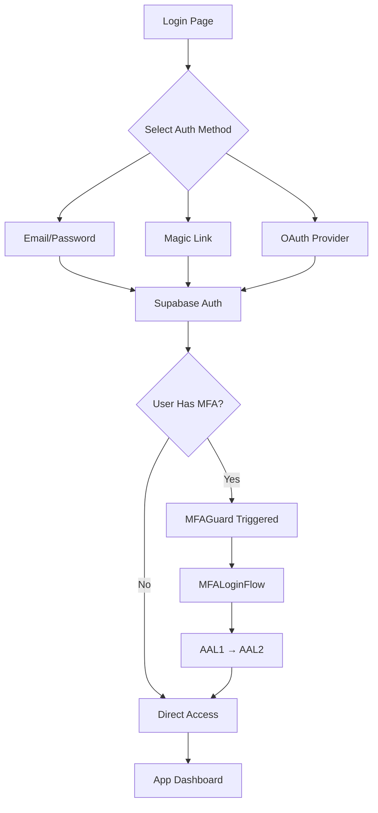

# Authentication Methods Implementation Roadmap

## Overview

Expand from single email/password authentication to multiple authentication options while maintaining existing MFA security.

## Current State

**✅ What We Have:**
- Email/password authentication
- SMS MFA with rate limiting UX fixes
- Robust MFA Guard and session management
- RLS policies with school isolation
- Supabase auth infrastructure

**🎯 What We're Adding:**
- Magic Link (Email SSO) authentication
- OAuth providers (Google, GitHub, Microsoft, Apple)
- Enhanced login UI with method selection
- Universal MFA enforcement across all auth methods

## Implementation Timeline

### **Week 1: Enhanced Login UI & Magic Links**

#### Day 1-2: Login UI Enhancement
```jsx
// Target: Update packages/web-app/src/app/auth/login.jsx
- Add authentication method selector
- Create reusable auth method components
- Maintain existing email/password form
- Add visual design for method selection
```

**Files to Modify:**
- `packages/web-app/src/app/auth/login.jsx`
- `packages/web-app/src/lib/supabase-mfa.js` (add magic link support)

**Tasks:**
- [x] Design auth method selector UI
- [ ] Create AuthMethodSelector component
- [ ] Update existing login form styling
- [ ] Add transition animations between methods

#### Day 3-4: Magic Link Implementation
```javascript
// Add magic link authentication
const handleMagicLinkLogin = async (email) => {
  const { error } = await supabase.auth.signInWithOtp({
    email: email,
    options: {
      emailRedirectTo: `${window.location.origin}/auth/callback`
    }
  })
}
```

**Tasks:**
- [ ] Implement MagicLinkForm component
- [ ] Add email template configuration in Supabase
- [ ] Create auth callback page
- [ ] Test magic link → MFA flow integration
- [ ] Add loading states and user feedback

#### Day 5: Testing & Polish
**Tasks:**
- [ ] Test magic link with MFA-enabled accounts
- [ ] Test magic link with non-MFA accounts  
- [ ] Verify existing functionality unchanged
- [ ] Add error handling for email delivery issues

### **Week 2: OAuth Provider Integration**

#### Day 1-2: Supabase OAuth Configuration
**Supabase Dashboard Setup:**
```
Authentication → Providers:
✅ Google OAuth (client ID/secret)
✅ GitHub OAuth (client ID/secret)  
✅ Microsoft OAuth (client ID/secret)
✅ Apple OAuth (for mobile future)
```

**Tasks:**
- [ ] Register OAuth applications with providers
- [ ] Configure redirect URLs in Supabase
- [ ] Set up provider credentials securely
- [ ] Test OAuth flow in development

#### Day 3-4: OAuth UI Implementation
```jsx
// OAuth provider buttons
const OAuthProviders = () => (
  <div className="oauth-providers">
    <OAuthButton provider="google" />
    <OAuthButton provider="github" />
    <OAuthButton provider="microsoft" />
  </div>
)
```

**Files to Create:**
- `packages/web-app/src/components/OAuthButton.jsx`
- `packages/web-app/src/components/OAuthProviders.jsx`

**Tasks:**
- [ ] Create OAuth provider button components
- [ ] Add provider logos and branding
- [ ] Implement OAuth login handlers
- [ ] Add loading states for OAuth redirects

#### Day 5: OAuth Testing & Integration
**Tasks:**
- [ ] Test Google OAuth → MFA flow
- [ ] Test GitHub OAuth → MFA flow
- [ ] Test Microsoft OAuth → MFA flow
- [ ] Verify AAL1 → AAL2 upgrade works for all providers
- [ ] Test error handling for OAuth failures

### **Week 3: Polish & User Experience**

#### Day 1-2: User Preferences & State Management
```javascript
// Remember user's preferred auth method
const AuthPreferences = {
  getPreferred: () => localStorage.getItem('preferred_auth_method'),
  setPreferred: (method) => localStorage.setItem('preferred_auth_method', method),
  clearPreferred: () => localStorage.removeItem('preferred_auth_method')
}
```

**Tasks:**
- [ ] Implement auth method preference storage
- [ ] Auto-select user's last used method
- [ ] Add "Remember my choice" option
- [ ] Create user preference management UI

#### Day 3-4: Error Handling & Edge Cases
**Tasks:**
- [ ] Enhanced error messages per auth method
- [ ] Handle OAuth cancellation gracefully
- [ ] Email delivery failure handling for magic links
- [ ] Rate limiting for magic link requests
- [ ] Provider-specific troubleshooting guides

#### Day 5: Security Review & Documentation
**Tasks:**
- [ ] Security review of all auth methods
- [ ] Test MFA enforcement across all methods
- [ ] Update security documentation
- [ ] Create user guides for each auth method

## Technical Architecture

### **Auth Method Flow Integration:**



### **Component Architecture:**

```
packages/web-app/src/
├── app/auth/
│   ├── login.jsx                    # Enhanced with method selector
│   └── callback.jsx                 # OAuth/Magic link callback handler
├── components/
│   ├── auth/
│   │   ├── AuthMethodSelector.jsx   # Method selection UI
│   │   ├── EmailPasswordForm.jsx    # Existing form extracted
│   │   ├── MagicLinkForm.jsx        # New magic link form
│   │   ├── OAuthProviders.jsx       # OAuth provider buttons
│   │   └── OAuthButton.jsx          # Individual provider button
│   ├── MFAGuard.jsx                # Unchanged - works with all methods
│   └── MFALoginFlow.jsx             # Unchanged - universal MFA flow
```

### **Database Changes: ZERO**
- All auth methods use same Supabase user table
- Existing MFA factors table unchanged
- RLS policies work universally
- School isolation continues working

## Security Considerations

### **MFA Enforcement (Universal):**
```sql
-- Same RESTRICTIVE policies work for all auth methods
CREATE POLICY "mfa_enforce_aal2" AS RESTRICTIVE
USING (public.check_mfa_required());
```

**Security Matrix:**
| Auth Method | Initial AAL | MFA Required | Final AAL | Data Access |
|-------------|-------------|--------------|-----------|-------------|
| Password    | AAL1        | If enabled   | AAL2      | ✅ Full     |
| Magic Link  | AAL1        | If enabled   | AAL2      | ✅ Full     |
| OAuth       | AAL1        | If enabled   | AAL2      | ✅ Full     |
| Any + No MFA | AAL1      | No           | AAL1      | ✅ Full     |

### **Attack Vector Analysis:**
- ✅ **OAuth compromise**: Still requires MFA if enabled
- ✅ **Email compromise**: Magic links expire, MFA still required
- ✅ **Password breach**: OAuth/Magic link alternatives available
- ✅ **Phishing**: MFA protects against credential theft

## Testing Strategy

### **Test Matrix:**
| Auth Method | User Type | Expected Flow |
|-------------|-----------|---------------|
| Password    | No MFA    | Direct access |
| Password    | With MFA  | MFA challenge → Access |
| Magic Link  | No MFA    | Email → Direct access |
| Magic Link  | With MFA  | Email → MFA challenge → Access |
| Google OAuth| No MFA    | OAuth → Direct access |
| Google OAuth| With MFA  | OAuth → MFA challenge → Access |
| GitHub OAuth| With MFA  | OAuth → MFA challenge → Access |
| MS OAuth    | With MFA  | OAuth → MFA challenge → Access |

### **Automated Testing:**
```javascript
// Test suite for all auth methods
describe('Multi-Auth Integration', () => {
  test('Password auth with MFA', async () => { /* ... */ })
  test('Magic link auth with MFA', async () => { /* ... */ })
  test('OAuth auth with MFA', async () => { /* ... */ })
  test('Auth method switching', async () => { /* ... */ })
  test('Rate limiting across methods', async () => { /* ... */ })
})
```

## User Experience Goals

### **Login Page UX:**
- **Intuitive**: Clear method selection with visual cues
- **Fast**: Remember user's preferred method
- **Accessible**: Keyboard navigation and screen reader support
- **Mobile-friendly**: Touch-optimized OAuth buttons

### **User Journey:**
1. **First-time users**: Guided method selection with recommendations
2. **Returning users**: Auto-select preferred method, quick access
3. **Enterprise users**: Direct SSO/OAuth options prominent
4. **Mobile users**: Touch-friendly OAuth, reduced password typing

## Success Metrics

### **Week 1 Success Criteria:**
- [ ] Magic link authentication working
- [ ] Existing password auth unchanged
- [ ] MFA flow works with both methods
- [ ] No regressions in current functionality

### **Week 2 Success Criteria:**
- [ ] 3+ OAuth providers configured and working
- [ ] OAuth → MFA flow seamless
- [ ] All auth methods redirect properly
- [ ] Error handling robust across providers

### **Week 3 Success Criteria:**
- [ ] User preference system working
- [ ] Comprehensive error handling
- [ ] Security review passed
- [ ] Documentation complete

### **Long-term Success Metrics:**
- **User adoption**: % of users trying new auth methods
- **Security improvement**: Reduced password-related support tickets
- **User satisfaction**: Fewer login-related issues
- **Enterprise readiness**: SSO capability for business customers

## Risk Mitigation

### **Rollback Strategy:**
- **Phase rollback**: Can disable individual auth methods in Supabase
- **UI rollback**: Feature flags for method selector
- **Database safety**: No schema changes required
- **User impact**: Existing users unaffected

### **Monitoring:**
- **Auth method usage analytics**
- **Error rates per auth method**  
- **MFA completion rates across methods**
- **Security incident tracking**

## Future Enhancements

### **Phase 2 (Post-Launch):**
- **SAML SSO** for enterprise customers
- **WebAuthn/FIDO2** biometric authentication
- **Passwordless flows** with magic links as primary
- **Social login expansion** (Apple, LinkedIn, Discord)

### **Phase 3 (Advanced):**
- **Custom OAuth providers** for enterprise integrations
- **Multi-tenant SSO** configurations
- **Advanced security policies** per auth method
- **Analytics dashboard** for auth method performance

This roadmap provides a clear, achievable path to implement multiple authentication methods while maintaining the security and functionality of your current MFA system.
